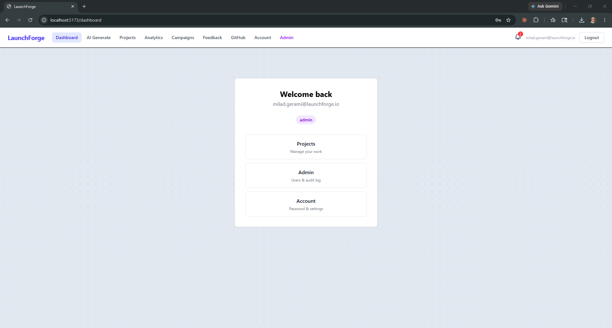
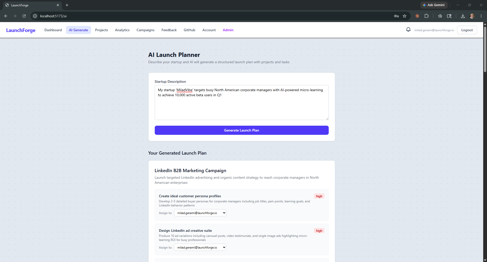
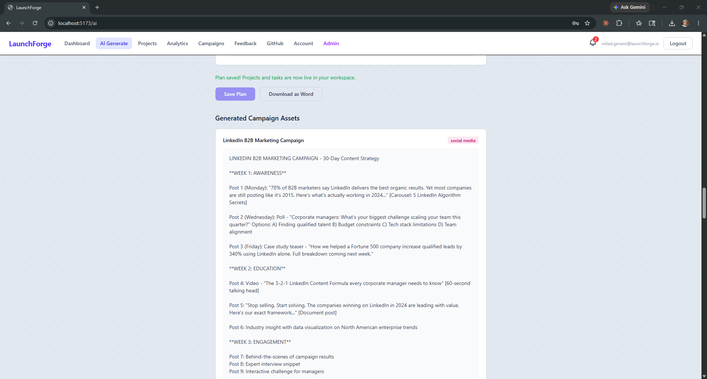
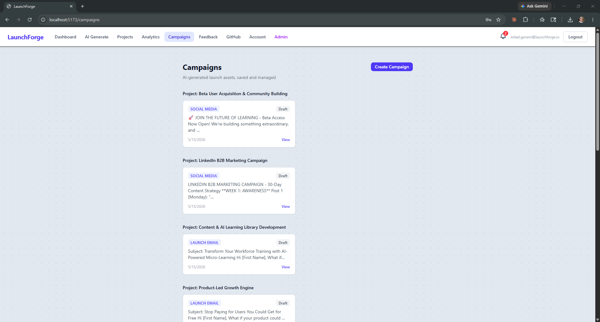
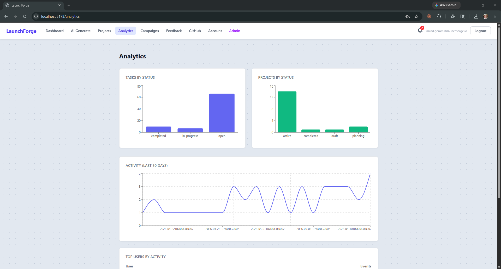
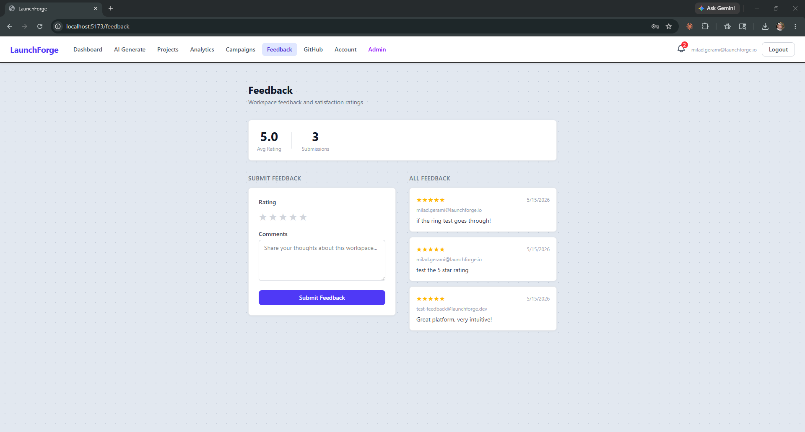
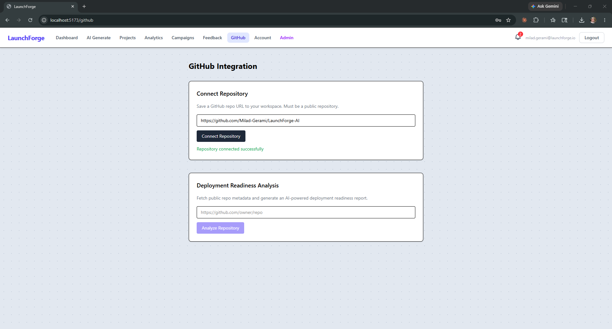
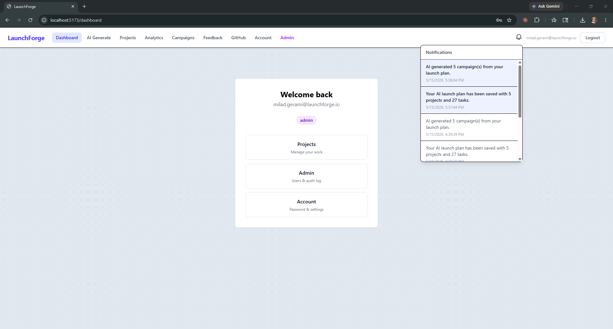
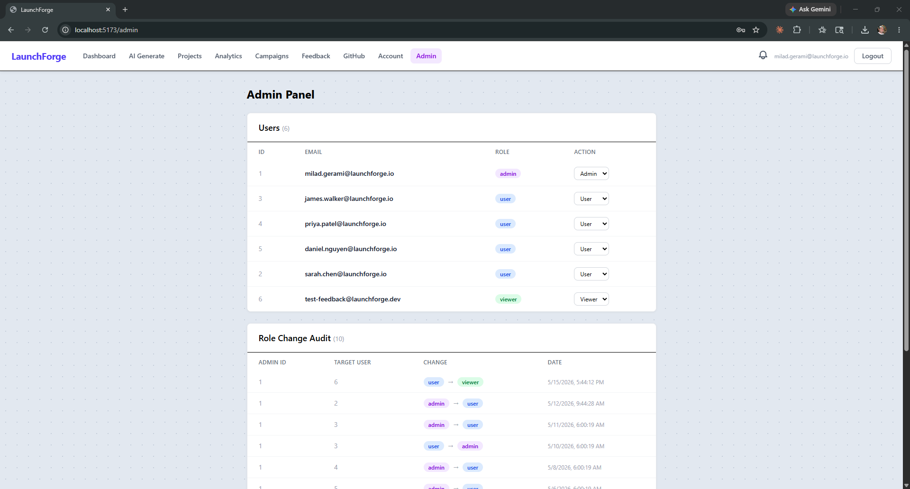

# LaunchForge AI

**A full-stack, AI-powered startup launch operating system.**

LaunchForge AI gives startups a single platform to plan their launch, generate marketing campaigns with AI, track team feedback, assess GitHub deployment readiness, and keep every team member notified — all behind a secure, role-based authentication system.

Built as a production-grade portfolio project: Node.js · Express 5 · PostgreSQL · Redis · React · TypeScript · Anthropic SDK · Docker · GitHub Actions

---

## What It Does

| Feature | Description |
|---|---|
| **AI Launch Plan Generation** | Describe your startup — AI returns a structured plan of projects and tasks with priorities. Review, assign team members, save to the database, and download as a Word document. |
| **Campaign Module** | Pick a campaign type, get AI-generated content, and track it through a Draft → Active → Complete lifecycle. Campaign assets can also be auto-generated per project after saving a launch plan. |
| **Workspace Management** | Each startup gets an isolated workspace with a name, industry, GitHub URL, and team members. All platform features operate within a workspace. |
| **GitHub Integration** | Connect a public repo — the platform fetches metadata (language, stars, last commit, open issues, README, license) and generates an AI deployment readiness report. |
| **Feedback System** | Team members submit 1–5 star ratings with text comments. The platform aggregates average rating and total count per workspace. |
| **In-App Notifications** | Key events (campaign created, feedback received, team member added) automatically generate in-app alerts with a bell icon and unread badge in the navbar. |
| **Analytics Dashboard** | Task completion rates, project statuses, and activity trends — pulled from PostgreSQL and displayed as charts. Redis-cached for performance. |
| **Role-Based Access Control** | Three roles: Admin (full access), User (create and manage), Viewer (read-only — designed for investors). Enforced at the API level, not just the UI. |

---

## Screenshots

| | |
|---|---|
|  |  |
| **Dashboard** | **AI Launch Plan Generator** |
|  |  |
| **AI Campaign Asset Generation** | **Campaigns — grouped by project** |
|  |  |
| **Analytics Dashboard** | **Feedback System** |
|  |  |
| **GitHub Integration & Readiness Report** | **In-App Notifications** |
|  | |
| **Admin Panel — Role Management** | |

---

## Tech Stack

| Layer | Technology |
|---|---|
| Backend | Node.js + Express 5 |
| Database | PostgreSQL (10 tables) |
| Cache | Redis via Memurai |
| Frontend | React + TypeScript + Vite + Tailwind CSS |
| Data Fetching | TanStack Query |
| Charts | Recharts |
| AI | Anthropic SDK (Claude) |
| Auth | JWT + bcrypt |
| Security | Helmet, 3-tier rate limiting, CORS |
| CI/CD | GitHub Actions (79 passing tests) |
| Deployment | Docker + Render |

---

## Database Schema

The platform uses 10 PostgreSQL tables:

**Core (v1)**
- `users` — auth, roles
- `projects` — launch plan phases
- `tasks` — individual work items with priority (high / medium / low)
- `project_activity` — task status change audit log
- `role_audit_log` — admin role assignment log

**Platform (v3)**
- `workspaces` — central startup environment
- `campaigns` — AI-generated marketing assets, linked to projects
- `feedback` — workspace ratings and comments
- `workspace_members` — multi-user workspace access
- `notifications` — in-app alert records

---

## API Surface

All endpoints require a valid JWT Bearer token unless marked Public.

### Auth
| Method | Endpoint | Access | Description |
|---|---|---|---|
| POST | `/api/register` | Public | Create account |
| POST | `/api/login` | Public | Returns JWT token |
| GET | `/api/me` | Auth | Current user info |

### Admin
| Method | Endpoint | Access | Description |
|---|---|---|---|
| GET | `/api/admin/users` | Admin | List all users |
| PUT | `/api/admin/users/:id/role` | Admin | Update user role |

### Workspaces
| Method | Endpoint | Access | Description |
|---|---|---|---|
| POST | `/api/workspaces` | Auth | Create workspace |
| GET | `/api/workspaces` | Auth | List user's workspaces |
| GET | `/api/workspaces/:id` | Auth | Get single workspace |

### Campaigns
| Method | Endpoint | Access | Description |
|---|---|---|---|
| POST | `/api/campaigns` | Auth | Create campaign (calls AI, saves to DB) |
| GET | `/api/campaigns` | Auth | List all campaigns |
| GET | `/api/campaigns/:id` | Auth | Get campaign with full content |
| PUT | `/api/campaigns/:id/status` | Auth | Update status |
| DELETE | `/api/campaigns/:id` | Auth | Delete campaign |

### Feedback
| Method | Endpoint | Access | Description |
|---|---|---|---|
| POST | `/api/feedback` | Auth | Submit feedback |
| GET | `/api/feedback/:workspaceId` | Auth | Get all feedback for workspace |
| GET | `/api/feedback/:workspaceId/summary` | Auth | Average rating + count |

### GitHub Integration
| Method | Endpoint | Access | Description |
|---|---|---|---|
| POST | `/api/github/connect` | Auth | Save repo URL to workspace |
| POST | `/api/github/analyze` | Auth | Fetch repo metadata + AI readiness report |

### Notifications
| Method | Endpoint | Access | Description |
|---|---|---|---|
| GET | `/api/notifications` | Auth | All notifications for current user |
| GET | `/api/notifications/unread` | Auth | Unread count |
| PUT | `/api/notifications/:id/read` | Auth | Mark one as read |
| PUT | `/api/notifications/read-all` | Auth | Mark all as read |

### AI
| Method | Endpoint | Access | Description |
|---|---|---|---|
| POST | `/api/ai/generate` | Auth | Original text generation (backwards-compatible) |
| POST | `/api/ai/generate-plan` | Auth | Generate structured launch plan preview |
| POST | `/api/ai/save-plan` | Auth | Save confirmed plan as projects + tasks |
| POST | `/api/ai/download-plan` | Auth | Download plan as Word document |
| POST | `/api/ai/generate-campaigns` | Auth | Generate campaign assets per project (parallel) |

### Analytics
| Method | Endpoint | Access | Description |
|---|---|---|---|
| GET | `/api/analytics` | Auth | Task completion, project status, activity trends (Redis-cached) |

---

## User Roles

| Role | Description | Can Access |
|---|---|---|
| **Admin** | Full platform control | Everything, including admin panel and role management |
| **User** | Standard team member | Create/edit workspaces, campaigns, feedback, GitHub integration |
| **Viewer** | Read-only (investor persona) | Dashboard, campaigns list, analytics — no create/edit/delete |

Role enforcement happens at the API level via `requireRole` middleware — not just the UI.

---

## AI Features

LaunchForge AI uses the **Anthropic SDK** (Claude) for three distinct capabilities:

**1. Launch Plan Generation**
The user describes their startup. A structured JSON prompt is sent to Claude, which returns a plan of projects and tasks. The response is parsed programmatically — AI output becomes real database records, not just text. Tasks include priority levels (high / medium / low) and can be assigned to team members before saving.

**2. Campaign Content Generation**
Supports 8 campaign types: social media post, email newsletter, product launch announcement, investor pitch summary, press release, blog post, ad copy, and landing page copy. Content is saved to the `campaigns` table and managed through a Draft → Active → Complete lifecycle.

**3. GitHub Deployment Readiness Report**
Public repo metadata (language, stars, last commit, open issues, README presence, license) is fetched from the GitHub API and passed to Claude with a readiness assessment prompt. The report surfaces what's in good shape, what's missing, and recommended next steps.

---

## Security

- **JWT authentication** — tokens expire after 1 hour; verified on every protected route
- **bcrypt password hashing** — passwords are never stored in plain text
- **Helmet** — sets HTTP security headers on every response
- **3-tier rate limiting** — general API, auth routes, and AI routes each have independent limits
- **CORS guard** — locked to approved origins
- **Role enforcement** — server-side middleware, not UI-only

---

## Running Locally

### Prerequisites
- Node.js 18+
- PostgreSQL
- Redis (or [Memurai](https://www.memurai.com/) on Windows)

### Setup

```bash
# Clone the repository
git clone https://github.com/Milad-Gerami/LaunchForge-AI.git
cd LaunchForge-AI
```

```bash
# Install backend dependencies
npm install
```

```bash
# Install frontend dependencies
cd client
npm install
cd ..
```

Create a `.env` file in the root directory:

```env
DB_HOST=localhost
DB_PORT=5432
DB_NAME=launchforge_db
DB_USER=your_db_user
DB_PASSWORD=your_db_password
JWT_SECRET=your_jwt_secret
ANTHROPIC_API_KEY=your_anthropic_api_key
REDIS_URL=redis://localhost:6379
PORT=3000
```

```bash
# Run database migrations
psql -U your_db_user -d launchforge_db -f db/migrations/v1_schema.sql
psql -U your_db_user -d launchforge_db -f db/migrations/v3_migration.sql
```

```bash
# Start the backend
npm run dev
```

```bash
# Start the frontend (separate terminal)
cd client
npm run dev
```

---

## Running Tests

```bash
npm test
```

79 tests covering auth, RBAC, API endpoints, and service logic. GitHub Actions runs the full suite on every push.

---

## Deployment

The repository includes:
- `Dockerfile` — containerized backend
- `render.yaml` — Render deployment blueprint
- `.env.example` — environment variable template

---

## Project Structure

```
LaunchForge-AI/
├── server.js                  # Express app entry point
├── db/
│   ├── index.js               # PostgreSQL connection pool
│   ├── redis.js               # Redis client
│   └── migrations/            # SQL migration scripts
├── middleware/
│   └── auth.js                # JWT authenticate + requireRole
├── routes/                    # Route definitions
├── controllers/               # Request/response handlers
├── services/                  # Business logic + DB queries
├── client/                    # React + TypeScript frontend
│   └── src/
│       ├── pages/             # Analytics, AIGenerate, Campaigns, Feedback, etc.
│       └── components/        # NavBar, shared UI
├── Dockerfile
├── render.yaml
└── .env.example
```

---

## What Was Intentionally Scoped Out

| Item | Reason |
|---|---|
| Billing / subscription tiers | Enterprise scope — Stripe integration is a product phase beyond internship timeline |
| Adaptive AI learning | Enterprise scope — requires usage data accumulation over time |
| Email notifications | In-app notifications satisfy the spec; email is a straightforward extension of the existing notification service |
| Full static code analysis | GitHub integration fetches public metadata and generates AI analysis — full AST-level analysis is a separate product |

---

## Built By

**Milad Gerami** — Internship portfolio project, 2026  
GitHub: [Milad-Gerami](https://github.com/Milad-Gerami)
