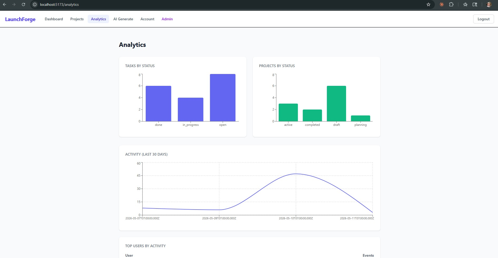
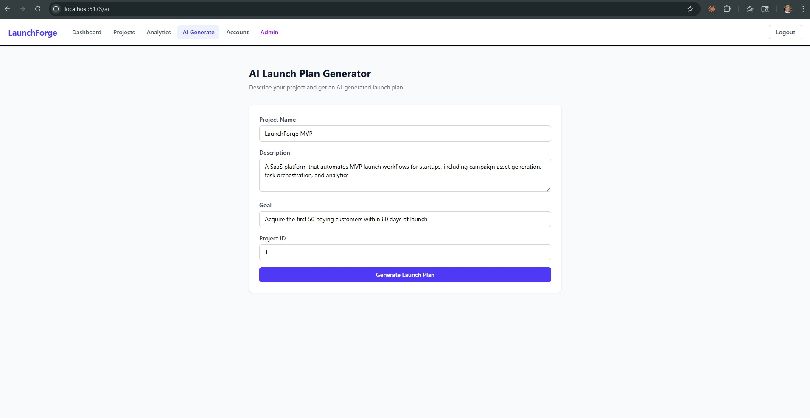
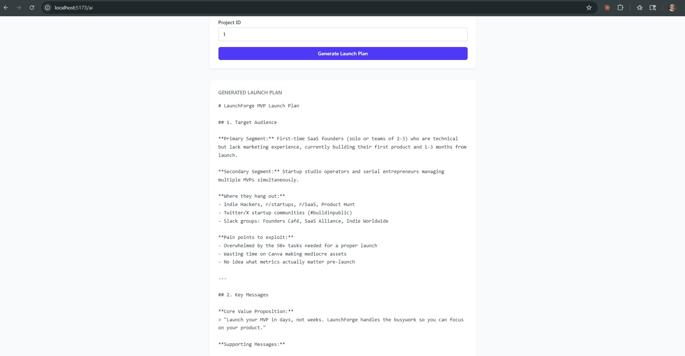
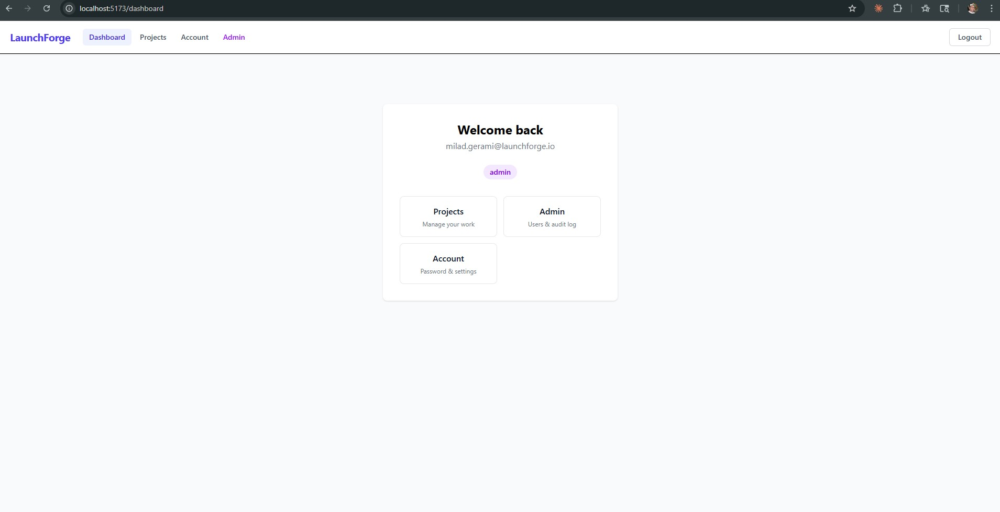
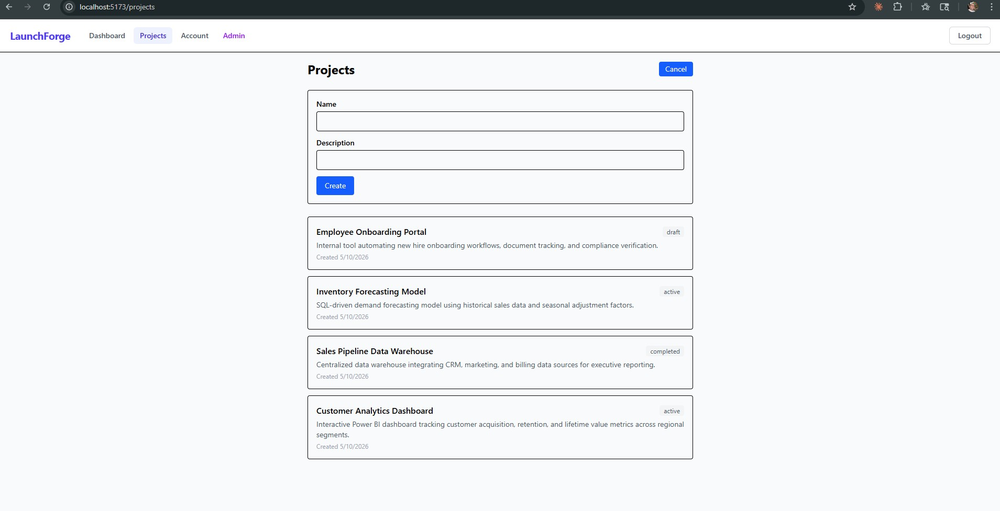
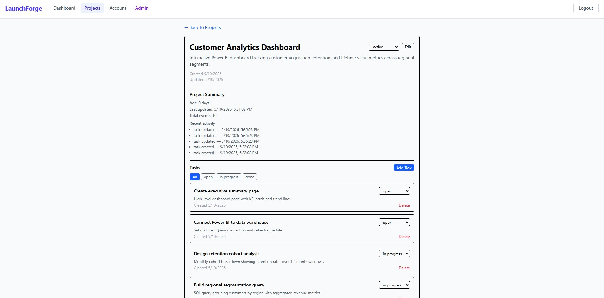
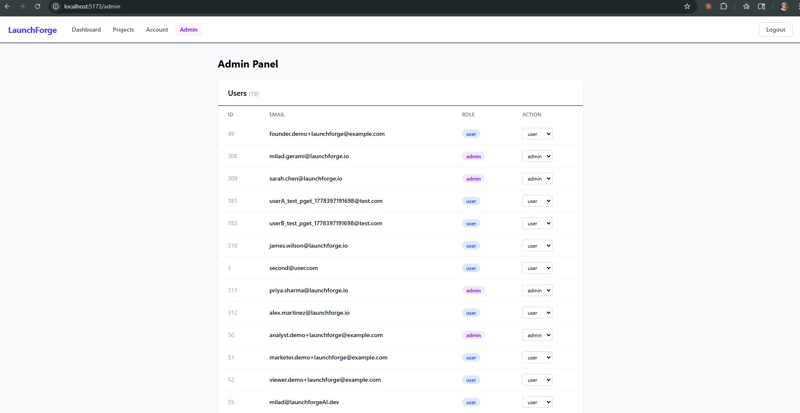
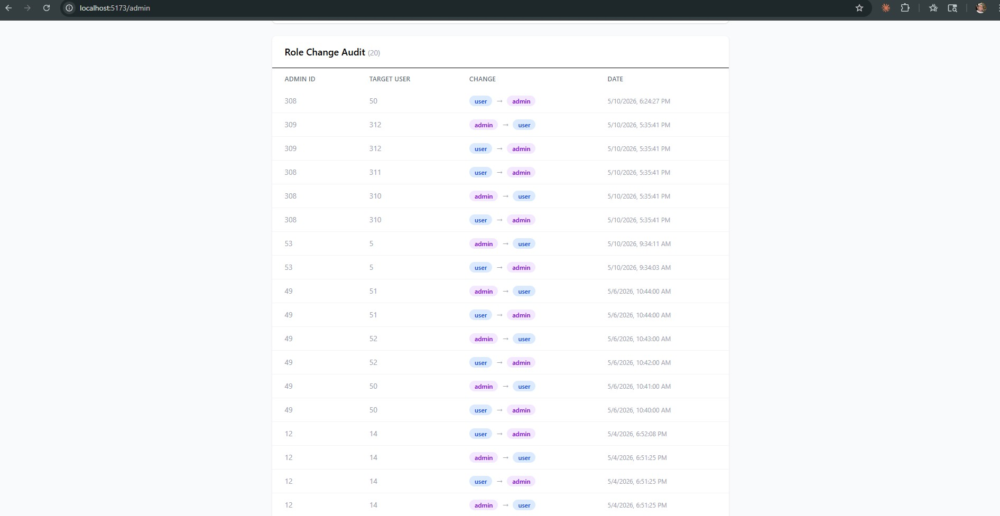

# LaunchForge AI

Full-stack AI-powered project management platform demonstrating end-to-end development: REST API design, relational database modeling, JWT authentication, role-based access control, AI content generation, analytics, Redis caching, and a React frontend — built with production-aware security hardening and deployment readiness.

## Feature Highlights

- **AI Launch Plan Generator** — Users describe a project and receive a structured, AI-generated launch plan via the Claude API, logged to the activity table for audit tracking
- **Analytics Dashboard** — Real-time charts showing task completion rates, project status distribution, 30-day activity trends, and user engagement — powered by PostgreSQL aggregation queries
- **Redis Caching** — Analytics results cached in Redis with a 60-second TTL, reducing database load and improving response times
- **Project Management** — Full CRUD with status tracking (planning/active/completed) and per-project dashboards with activity feeds
- **Task System** — Create, update, filter, and delete tasks within projects with status management (open/in_progress/done)
- **Authentication** — JWT-based auth with bcrypt password hashing, token interceptors, and automatic session handling
- **Admin Panel** — User management, role updates with last-admin protection, audit logging, and admin analytics
- **Security Hardening** — Helmet headers, three-tier rate limiting, CORS production guard, and environment validation
- **Deployment Ready** — Dockerized backend, Render blueprint, GitHub Actions CI/CD, and idempotent migrations

## Screenshots

**Analytics Dashboard** — Task and project status charts, 30-day activity trend, and top users by engagement

**AI Launch Plan Generator** — Form input and generated launch plan output

**Dashboard** — Authenticated admin view with role badge and quick navigation

**Projects** — Project listing with status badges and create form

**Project Detail** — Tasks with mixed statuses, due dates, and activity feed

**Admin Panel** — User management with role-based access control

**Audit Log** — Role change history with admin attribution and timestamps

## Architecture Overview

    React SPA (Vite + TypeScript)
           |
           | Axios + JWT Bearer
           v
    Express REST API
           |
           +---> Anthropic Claude API (AI generation)
           |
           +---> PostgreSQL (relational data)
           |
           +---> Redis (caching layer)

**Data flow:** The React frontend communicates with the Express API over HTTP using JWT Bearer tokens. The API validates authentication and authorization, then queries PostgreSQL for persistent data. Redis caches frequently accessed analytics results with a TTL-based expiry strategy. AI generation requests are forwarded to the Claude API with structured prompts built from user project data.

**Schema design:** Five tables — `users`, `projects`, `tasks`, `project_activity`, `role_audit_log` — with foreign key relationships, indexes on lookup columns, and cascading deletes where appropriate.

## Tech Stack

| Layer | Technologies |
|-------|-------------|
| Frontend | React 19, TypeScript, Vite 6, React Router 7, TanStack Query 5, Tailwind CSS 4, Axios, Recharts |
| Backend | Node.js, Express 5, PostgreSQL 16 (pg driver), Redis, JWT, bcrypt, Anthropic SDK |
| Security | Helmet, express-rate-limit, CORS with production guard |
| Infrastructure | Docker, Docker Compose, GitHub Actions CI/CD |
| Deployment | Render blueprint (render.yaml) — backend, frontend, PostgreSQL, Redis |
| Testing | Jest 30, Supertest — 79 backend tests across 9 suites |

## Backend API

25 RESTful endpoints across five domains:

- **Auth** — Registration, login, password management, session validation
- **Projects** — Full CRUD with status tracking, ownership scoping, and per-project dashboards
- **Tasks** — CRUD with status filtering, scoped to projects
- **Admin** — User management, role updates with guards, audit logging, analytics (rate-limited)
- **AI** — Launch plan and campaign copy generation via Claude API, with activity logging
- **Analytics** — Aggregated metrics: task stats, project stats, activity trends, user engagement (Redis-cached)
- **Health** — Live dependency checks returning per-component status (database, Redis)

Full endpoint documentation is available in [PROJECT_STATE.md](PROJECT_STATE.md).

## Frontend

Built with React 19 + TypeScript + Vite. All routes are protected except login, register, and the landing page.

| Route | Description |
|-------|-------------|
| / | Landing page |
| /login | Authentication form |
| /register | Account creation |
| /dashboard | User dashboard |
| /projects | Project listing and creation |
| /projects/:id | Project detail, editing, status, tasks, dashboard |
| /account | Password management |
| /admin | User management, role updates, audit log, analytics |
| /analytics | Charts: task stats, project stats, activity trend, user engagement |
| /ai | AI launch plan generator form and output |

**Key patterns:** Axios interceptor attaches JWT to all requests and redirects to login on 401. TanStack Query handles server state with 5-minute stale time. Protected routes check token presence before rendering.

## Security and Production Hardening

| Layer | Implementation |
|-------|---------------|
| **Authentication** | bcrypt password hashing, JWT with 1-hour expiry |
| **Authorization** | Role-based access control (user/admin), last-admin protection, self-modification prevention |
| **HTTP Headers** | Helmet (X-Content-Type-Options, X-Frame-Options, HSTS, Referrer-Policy) |
| **Rate Limiting** | Auth: 20 req/15min, API: 100 req/min, Admin: 10 req/min |
| **CORS** | Environment-based origin with production fail-fast (server refuses to start without CORS_ORIGIN) |
| **Secrets** | No production secrets in git history (audited), .env.example with placeholders only |
| **Health Checks** | Live PostgreSQL and Redis verification with per-component status reporting |
| **Migrations** | All SQL migrations idempotent (IF NOT EXISTS guards) |

## CI/CD and Deployment Readiness

**GitHub Actions CI pipeline:**
- Backend tests against PostgreSQL 16 service container (79 tests, 9 suites)
- Frontend build validation (TypeScript compilation + Vite build)
- Docker image build verification

**Deployment configuration:**
- Production-ready Dockerfile (Node 20-alpine, NODE_ENV=production)
- Docker Compose for local full-stack development
- Render blueprint (`render.yaml`) defining four resources:
  - Backend web service (Docker)
  - Frontend static site (SPA with rewrite rules)
  - PostgreSQL database
  - Key Value/Redis instance

> Deployment configuration is committed and validated. Live hosting was intentionally skipped — the repository is deployment-ready, not production-live.

## Local Setup

### Prerequisites
- Node.js 20+
- PostgreSQL 16+
- Redis (optional)
- Docker and Docker Compose (optional)
- Anthropic API key (required for AI generation feature)

### Option 1: Docker Compose

    docker-compose up

Backend available at http://localhost:3000, PostgreSQL at port 5433.

### Option 2: Manual Setup

    # Backend
    cp .env.example .env        # Edit with your database credentials and ANTHROPIC_API_KEY
    npm install
    npm start                   # http://localhost:3000

    # Frontend
    cd client
    cp .env.example .env        # Edit API URL if needed
    npm install
    npm run dev                 # http://localhost:5173

### Run Tests

    npm test

## Environment Variables

- **Backend:** 12 variables defined in `.env.example` (database, auth, CORS, Redis, Anthropic API key)
- **Frontend:** 1 variable defined in `client/.env.example` (API base URL)

Copy the example files and fill in your values — see [.env.example](.env.example) and [client/.env.example](client/.env.example).

## Project Structure

    ├── app.js / server.js        # Express app and server entry point
    ├── routes/                   # Route definitions (auth, health)
    ├── controllers/              # Request handlers
    ├── services/                 # Business logic
    ├── middleware/               # JWT verification, role checking
    ├── db/                       # PostgreSQL pool, Redis client, migrations
    ├── src/api/                  # Feature modules (admin, projects, tasks, AI, analytics, tests)
    ├── client/                   # React frontend (Vite + TypeScript)
    ├── Dockerfile                # Production container
    ├── docker-compose.yml        # Local development stack
    ├── render.yaml               # Render deployment blueprint
    └── .github/workflows/ci.yml  # GitHub Actions CI pipeline

## Project Summary

LaunchForge AI is a portfolio project demonstrating:

- **AI integration** — Connecting a production backend to the Claude API with structured prompt engineering, response handling, and activity logging
- **Analytics and data modeling** — PostgreSQL aggregation queries surfaced as a visual dashboard with Redis caching for performance
- **Database design** — Normalized PostgreSQL schema with foreign keys, indexes, audit tables, and cascading relationships
- **API architecture** — RESTful Express API with layered controller/service pattern, parameterized queries, and ownership-scoped data access
- **Security engineering** — JWT authentication, bcrypt hashing, role-based authorization, rate limiting, Helmet headers, and CORS hardening
- **Frontend development** — React SPA with TypeScript, protected routing, server state management, and responsive UI
- **Operational readiness** — Docker containerization, GitHub Actions CI/CD, environment contracts, idempotent migrations, and Render deployment blueprint

Built across eight phases: v1 established the backend foundation, authentication, RBAC, and React frontend. v2 added AI content generation, an analytics dashboard, and a Redis caching layer.
